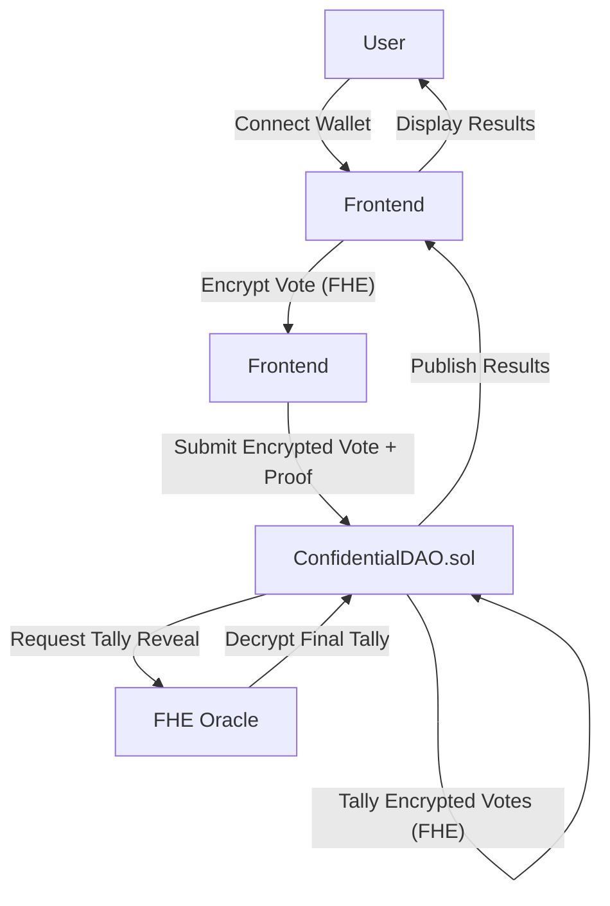

# Architecture

Confidential DAO is a privacy-preserving governance platform built with several tightly integrated components. This section provides a deep technical dive into each part of the system, especially the smart contract and cryptographic mechanisms.

---

## 1. Smart Contract: `ConfidentialDAO.sol`

The heart of the system is the `ConfidentialDAO` contract, which manages proposals, voting, and tally reveals using Fully Homomorphic Encryption (FHE).

### Data Structures
- **Proposal struct**: Stores all relevant data for a proposal, including encrypted vote tallies, creator, token, end time, and reveal status.
- **proposals[]**: Array of all proposals.
- **hasVoted**: Mapping to prevent double voting.

### Key Functions

#### `createProposal(address token, uint256 durationSeconds)`
- **Purpose**: Allows any user to create a new proposal by specifying a governance token and voting duration. Requires a proposal fee.
- **How it works**: Initializes a Proposal struct with encrypted vote tallies set to zero, sets the end time, and emits a `ProposalCreated` event.

#### `vote(uint256 proposalId, externalEuint64 encryptedVote, bytes calldata inputProof)`
- **Purpose**: Lets token holders cast an encrypted vote (For, Against, Abstain) on a proposal.
- **How it works**:
  - Checks eligibility (token holder, not already voted, voting still open).
  - Accepts an encrypted vote and a cryptographic proof.
  - Uses FHE to process the encrypted vote and increment the correct tally (For/Against/Abstain) without revealing the vote.
  - Marks the voter as having voted and emits a `Voted` event.

#### `requestTallyReveal(uint256 proposalId)`
- **Purpose**: After voting ends, the proposal creator can request the final tally to be decrypted.
- **How it works**:
  - Ensures voting is over and the proposal is unresolved.
  - Calls the FHE oracle to decrypt the encrypted tallies.
  - Stores the decryption request ID and emits a `TallyRevealRequested` event.

#### `resolveTallyCallback(...)`
- **Purpose**: Called by the FHE oracle to provide the decrypted tallies.
- **How it works**:
  - Verifies the oracle's signature.
  - Updates the proposal with the revealed tallies and marks it as resolved.
  - Emits a `ProposalResolved` event.

#### View Functions
- `getProposal`, `getDecryptionRequestId`, `getRevealStatus`, `isRevealRequested`: Provide proposal and reveal status information to the frontend.

#### Admin Functions
- `setProposalFee`, `withdrawFees`: Allow the contract owner to set fees and withdraw collected fees.

---

## 2. FHE Cryptography

- **Client-side Encryption**: Votes are encrypted in the user's browser using FHE libraries (e.g., Zama FHEVM JS/WASM bindings).
- **On-chain Computation**: The contract receives only ciphertexts and uses FHE operations to tally votes without ever decrypting them.
- **Decryption Oracle**: After voting, the contract requests an off-chain oracle (e.g., Zama FHEVM gateway) to decrypt the final tallies. Only the aggregate result is revealed, never individual votes.
- **Security**: The cryptographic proofs ensure that only valid votes are counted, and the oracle's signatures prevent tampering.

---

## 3. Frontend (React)

- **Wallet Integration**: Users connect via MetaMask or WalletConnect.
- **Proposal Management**: Users can create proposals, specifying the governance token and voting period.
- **Voting Flow**:
  - User selects a proposal and vote option.
  - Vote is encrypted locally using FHE.
  - A cryptographic proof is generated and sent with the vote to the contract.
  - The UI updates to show voting status and disables further voting for that proposal.
- **Tally Reveal**: After voting ends, the proposal creator can trigger the reveal. The UI polls for the revealed tally and displays results.
- **Off-chain Storage**: Firebase is used for proposal metadata, notifications, and possibly for storing encrypted votes for analytics.

---

## 4. System Flow Diagram

---

## 5. Security & Privacy Considerations
- **No plaintext votes** are ever stored or transmitted on-chain.
- **Oracle trust**: Only the final tally is decrypted, and signatures are checked for authenticity.
- **Double voting**: Prevented by the `hasVoted` mapping.
- **Token gating**: Only token holders can vote on proposals for that token.

This architecture ensures that Confidential DAO achieves its goal of private, secure, and fair decentralized governance. 